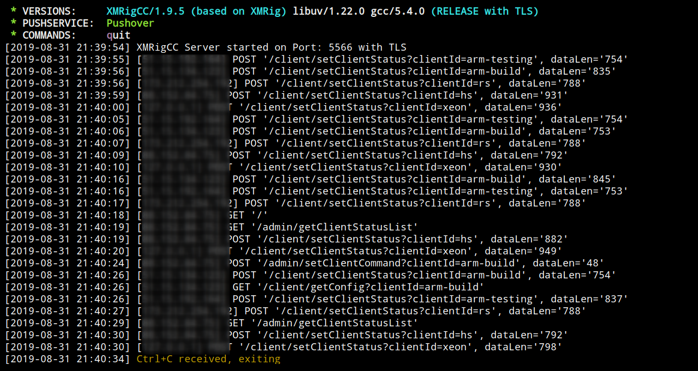
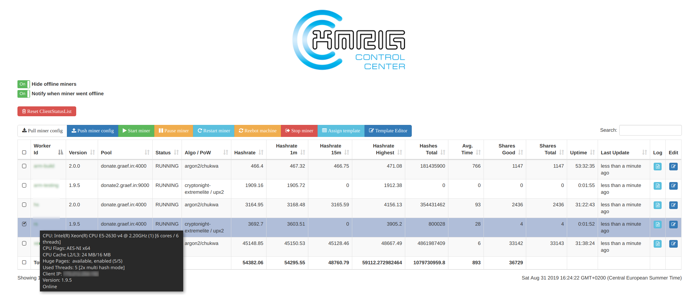

# XMRigCC 

**:warning: [Monero will change PoW algorithm to RandomX on November 30.](https://github.com/xmrig/xmrig/issues/1204)**
XMRig is a high performance RandomX, CryptoNight and Argon2 CPU miner, with official support for Windows.

:bulb: **This is the CPU variant of XMRigCC, if you're looking for the AMD GPU (OpenCL) variant [click here](https://github.com/Bendr0id/xmrigCC-amd/).**

[](https://ci.appveyor.com/project/Bendr0id/xmrigcc)
[](https://hub.docker.com/r/bendr0id/xmrigcc/)
[](https://github.com/bendr0id/xmrigCC/releases)
[](https://github.com/bendr0id/xmrigCC/releases)
[](https://github.com/bendr0id/xmrigCC/releases)
[](https://github.com/bendr0id/xmrigCC/stargazers)


### About XMRigCC

XMRigCC is a [XMRig](https://github.com/xmrig/xmrig) fork which adds remote control and monitoring functions to XMRigCC miners. It lets you control your miners via a Dashboard or the REST api.
XMRigCC has a "Command and Control" (C&amp;C) server part, a daemon to keep the XMRigCC miner alive and modifications to send the current status to the C&amp;C Server.
The modified version can handle commands like "update config", "start/stop mining" or "restart/shutdown/reboot" which can be send from the C&amp;C-Server Dashboard. 
Assign config templates to multiple miners with a single click and let them switch configs without connecting to each of them.
Watch your miners logs with the simple remote Log viewer and monitor you miners. When the hashrate drops or one of your miners went offline you can get a notification via 
PushOver or Telegram automatically so that you dont need to watch your miners all day.

Full Windows/Linux compatible, and you can mix Linux and Windows miner on one XMRigCCServer.

## Additional features of XMRigCC (on top of XMRig)

Check the [Coin Configuration](https://github.com/Bendr0id/xmrigCC/wiki/Coin-configurations) guide
* **Support of UPX2 variant (algo: "cn-extremelite/upx2")**
* **Support of CN-Conceal variant (algo: "cn/conceal")**
* **Better performance for ARMv8 CPUs**
* Full SSL/TLS support
* NUMA support
* Command and control server
* CC Dashboard with:
    * statistics of all connected miners
    * remote control miners (start/stop/restart/shutdown) 
    * remote configuration changes of miners
    * simple config editor for miner / config templates 
    * monitoring / offline notification push notifications via Pushover and Telegram 
* Daemon to restart the miner


**XMRigCC Miner**


**XMRigCC Server**



**XMRigCC Dashboard**



#### Table of contents
* [Download](#download)
* [Usage](#usage)
* [Wiki/Building/Howto](https://github.com/Bendr0id/xmrigCC/wiki/)
* [Common Issues](#common-issues)
* [Donations](#donations)
* [Contacts](#contact)

## Download
* Binary releases: https://github.com/Bendr0id/xmrigCC/releases
* Git tree: https://github.com/Bendr0id/xmrigCC.git
  * Clone with `git clone https://github.com/Bendr0id/xmrigCC.git` :hammer: [Build instructions](https://github.com/xmrig/xmrig/wiki/Build.

## Usage
### Basic example XMRigCCServer
```
xmrigCCServer --cc-port=3344 --cc-user=admin --cc-pass=pass --cc-access-token=SECRET_TOKEN_TO_ACCESS_CC_SERVER
```

### Options XMRigCCServer
```
      --cc-user=USERNAME                CC Server admin user
      --cc-pass=PASSWORD                CC Server admin pass
      --cc-access-token=T               CC Server access token for CC Client
      --cc-port=N                       CC Server port
      --cc-use-tls                      enable tls encryption for CC communication
      --cc-cert-file=FILE               when tls is turned on, use this to point to the right cert file (default: server.pem) 
      --cc-key-file=FILE                when tls is turned on, use this to point to the right key file (default: server.key) 
      --cc-client-log-lines-history=N   maximum lines of log history kept per miner (default: 100)
      --cc-client-config-folder=FOLDER  Folder contains the client config files
      --cc-pushover-user-key            your user key for pushover notifications
      --cc-pushover-api-token           api token/keytoken of the application for pushover notifications
      --cc-telegram-bot-token           your bot token for telegram notifications
      --cc-telegram-chat-id             your chat-id for telegram notifications
      --cc-push-miner-offline-info      push notification for offline miners and recover push
      --cc-push-miner-zero-hash-info    push notification when miner reports 0 hashrate and recover push
      --cc-push-periodic-mining-status  push periodic status notification (every hour)
      --cc-custom-dashboard=FILE        loads a custom dashboard and serve it to '/'
      --no-color                        disable colored output
  -S, --syslog                          use system log for output messages
  -B, --background                      run the miner in the background
  -c, --config=FILE                     load a JSON-format configuration file
  -l, --log-file=FILE                   log all output to a file
  -h, --help                            display this help and exit
  -V, --version                         output version information and exit
```


### Basic example xmrigDaemon
```
xmrigDaemon -o pool.minemonero.pro:5555 -u YOUR_WALLET -p x -k --cc-url=IP_OF_CC_SERVER:PORT --cc-access-token=SECRET_TOKEN_TO_ACCESS_CC_SERVER --cc-worker-id=OPTIONAL_WORKER_NAME
```

### Options xmrigDaemon
```
  -a, --algo=ALGO                   specify the algorithm to use
                                      cn/r, cn/2, cn/1, cn/0, cn/double, cn/half, cn/fast,
                                      cn/rwz, cn/zls, cn/xao, cn/rto, cn/conceal,
                                      cn-lite/1,
                                      cn-heavy/xhv, cn-heavy/tube, cn-heavy/0,
                                      cn-pico
                                      cn-extremelite
                                      argon2/chukwa, argon2/wrkz
                                      rx/wow, rx/loki
  -o, --url=URL                     URL of mining server
  -O, --userpass=U:P                username:password pair for mining server
  -u, --user=USERNAME               username for mining server
  -p, --pass=PASSWORD               password for mining server
      --rig-id=ID                   rig identifier for pool-side statistics (needs pool support)
  -t, --threads=N                   number of miner threads
  -v, --av=N                        algorithm variation, 0 auto select
  -k, --keepalive                   send keepalived packet for prevent timeout (needs pool support)
      --nicehash                    enable nicehash.com support
      --tls                         enable SSL/TLS support (needs pool support)
      --tls-fingerprint=F           pool TLS certificate fingerprint, if set enable strict certificate pinning
      --daemon                      use daemon RPC instead of pool for solo mining
      --daemon-poll-interval=N      daemon poll interval in milliseconds (default: 1000)
  -r, --retries=N                   number of times to retry before switch to backup server (default: 5)
  -R, --retry-pause=N               time to pause between retries (default: 5)
      --cpu-affinity                set process affinity to CPU core(s), mask 0x3 for cores 0 and 1
      --cpu-priority                set process priority (0 idle, 2 normal to 5 highest)
      --no-huge-pages               disable huge pages support
      --no-color                    disable colored output
      --donate-level=N              donate level, default 5% (5 minutes in 100 minutes)
      --user-agent                  set custom user-agent string for pool
  -B, --background                  run the miner in the background
  -c, --config=FILE                 load a JSON-format configuration file
  -l, --log-file=FILE               log all output to a file
  -S, --syslog                      use system log for output messages
      --asm=ASM                     ASM optimizations, possible values: auto, none, intel, ryzen, bulldozer.
      --print-time=N                print hashrate report every N seconds
      --api-worker-id=ID            custom worker-id for API
      --api-id=ID                   custom instance ID for API
      --http-enabled                enable HTTP API
      --http-host=HOST              bind host for HTTP API (default: 127.0.0.1)
      --http-port=N                 bind port for HTTP API
      --http-access-token=T         access token for HTTP API
      --http-no-restricted          enable full remote access to HTTP API (only if access token set)
      --randomx-init=N              threads count to initialize RandomX dataset
      --randomx-no-numa             disable NUMA support for RandomX
      --export-topology             export hwloc topology to a XML file and exit
      --cc-disabled                 disable CC Client feature
      --cc-url=URL                  url of the CC Server
      --cc-access-token=T           access token for CC Server
      --cc-worker-id=ID             custom worker-id for CC Server
      --cc-update-interval-s=N      status update interval in seconds (default: 10 min: 1)
      --cc-use-tls                  enable tls encryption for CC communication
      --cc-use-remote-logging       enable remote logging on CC Server
      --cc-upload-config-on-start   upload current miner config to CC Server on startup
      --cc-reboot-cmd=CMD           command/bat to execute to Reboot miner machine
      --dry-run                     test configuration and exit
  -h, --help                        display this help and exit
  -V, --version                     output version information and exit
```


## Common Issues
### XMRigMiner
* XMRigMiner is just the worker, it is not designed to work standalone. Please start **XMRigDaemon** instead.

### Windows only: DLL error on starting
* Make sure that you installed latest Visual C++ Redistributable for Visual Studio 2015. Can be downloaded here: [microsoft.com](https://www.microsoft.com/de-de/download/details.aspx?id=48145)

### Linux only: Background mode
* The `--background` option will only work properly for the XMRigServer. But there is a simple workaround for the XMRigDaemon process. Just append an `&` to the command and it will run smoothly in the background.

    `./xmrigDaemon --config=my_config_cc.json &` or you just use `screen`


### HUGE PAGES unavailable (Windows)
* Run XMRigDaemon as Administrator.
* On Windows it automatically enables SeLockMemoryPrivilege for current user, but reboot or sign out still required. [Manual instruction](https://msdn.microsoft.com/en-gb/library/ms190730.aspx).

### HUGE PAGES unavailable (Linux)
* Before starting XMRigDaemon set huge pages

    `sudo sysctl -w vm.nr_hugepages=128`

 
## Donations
* Default donation 5% (5 minutes in 100 minutes) can be reduced to 1% via command line option `--donate-level`. 

##### BenDroid (XMRigCC):
XMR:  `4BEn3sSa2SsHBcwa9dNdKnGvvbyHPABr2JzoY7omn7DA2hPv84pVFvwDrcwMCWgz3dQVcrkw3gE9aTC9Mi5HxzkfF9ev1eH`

AEON: `Wmtm4S2cQ8uEBBAVjvbiaVAPv2d6gA1mAUmBmjna4VF7VixLxLRUYag5cvsym3WnuzdJ9zvhQ3Xwa8gWxPDPRfcQ3AUkYra3W`

BTC:  `3Gwq9tveCZtLAiXX7mxhjbrh38GPx1iXdB`

##### xmrig:
XMR:  `48edfHu7V9Z84YzzMa6fUueoELZ9ZRXq9VetWzYGzKt52XU5xvqgzYnDK9URnRoJMk1j8nLwEVsaSWJ4fhdUyZijBGUicoD`

BTC:  `1P7ujsXeX7GxQwHNnJsRMgAdNkFZmNVqJT`

## Contact
* ben [at] graef.in
* Telegram: @BenDr0id
* [discord](https://discord.gg/r3rCKTB)
* [reddit](https://www.reddit.com/user/BenDr0id/)
