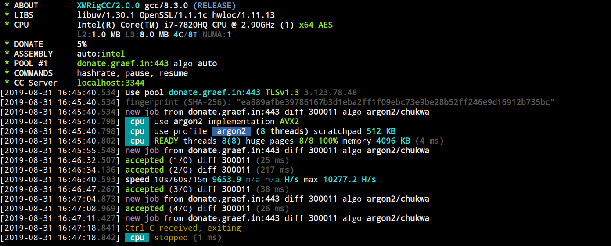

# XMRig

**:warning: [Monero will change PoW algorithm to RandomX on November 30.](https://github.com/xmrig/xmrig/issues/1204)**

[](https://github.com/xmrig/xmrig/releases)
[](https://github.com/xmrig/xmrig/releases)
[](https://github.com/xmrig/xmrig/releases)
[](https://github.com/xmrig/xmrig/blob/master/LICENSE)
[](https://github.com/xmrig/xmrig/stargazers)
[](https://github.com/xmrig/xmrig/network)

XMRig is a high performance RandomX and CryptoNight CPU miner, with official support for Windows.

* This is the **CPU-mining** version, there is also a [NVIDIA GPU version](https://github.com/xmrig/xmrig-nvidia) and [AMD GPU version]( https://github.com/xmrig/xmrig-amd).



#### Table of contents
* [Download](#download)
* [Usage](#usage)
* [Build](https://github.com/xmrig/xmrig/wiki/Build)
* [Donations](#donations)
* [Contacts](#contacts)

## Download
* Binary releases: https://github.com/xmrig/xmrig/releases
* Git tree: https://github.com/xmrig/xmrig.git
  * Clone with `git clone https://github.com/xmrig/xmrig.git` :hammer: [Build instructions](https://github.com/xmrig/xmrig/wiki/Build).

## Usage
The preferred way to configure the miner is the [JSON config file](src/config.json) as it is more flexible and human friendly. The command line interface does not cover all features, such as mining profiles for different algorithms. Important options can be changed during runtime without miner restart by editing the config file or executing API calls.

### Options
```
  -a, --algo=ALGO               specify the algorithm to use
                                  cn/r, cn/2, cn/1, cn/0, cn/double, cn/half, cn/fast,
                                  cn/rwz, cn/zls, cn/xao, cn/rto, cn/gpu,
                                  cn-lite/1,
                                  cn-heavy/xhv, cn-heavy/tube, cn-heavy/0,
                                  cn-pico,
                                  rx/wow, rx/loki
  -o, --url=URL                 URL of mining server
  -O, --userpass=U:P            username:password pair for mining server
  -u, --user=USERNAME           username for mining server
  -p, --pass=PASSWORD           password for mining server
      --rig-id=ID               rig identifier for pool-side statistics (needs pool support)
  -t, --threads=N               number of miner threads
  -v, --av=N                    algorithm variation, 0 auto select
  -k, --keepalive               send keepalived packet for prevent timeout (needs pool support)
      --nicehash                enable nicehash.com support
      --tls                     enable SSL/TLS support (needs pool support)
      --tls-fingerprint=F       pool TLS certificate fingerprint, if set enable strict certificate pinning
      --daemon                  use daemon RPC instead of pool for solo mining
      --daemon-poll-interval=N  daemon poll interval in milliseconds (default: 1000)
  -r, --retries=N               number of times to retry before switch to backup server (default: 5)
  -R, --retry-pause=N           time to pause between retries (default: 5)
      --cpu-affinity            set process affinity to CPU core(s), mask 0x3 for cores 0 and 1
      --cpu-priority            set process priority (0 idle, 2 normal to 5 highest)
      --no-huge-pages           disable huge pages support
      --no-color                disable colored output
      --donate-level=N          donate level, default 5% (5 minutes in 100 minutes)
      --user-agent              set custom user-agent string for pool
  -B, --background              run the miner in the background
  -c, --config=FILE             load a JSON-format configuration file
  -l, --log-file=FILE           log all output to a file
      --asm=ASM                 ASM optimizations, possible values: auto, none, intel, ryzen, bulldozer.
      --print-time=N            print hashrate report every N seconds
      --api-worker-id=ID        custom worker-id for API
      --api-id=ID               custom instance ID for API
      --http-enabled            enable HTTP API
      --http-host=HOST          bind host for HTTP API (default: 127.0.0.1)
      --http-port=N             bind port for HTTP API
      --http-access-token=T     access token for HTTP API
      --http-no-restricted      enable full remote access to HTTP API (only if access token set)
      --randomx-init=N          threads count to initialize RandomX dataset
      --randomx-no-numa         disable NUMA support for RandomX
      --export-topology         export hwloc topology to a XML file and exit
      --dry-run                 test configuration and exit
  -h, --help                    display this help and exit
  -V, --version                 output version information and exit
```

## Donations
* Default donation 5% (5 minutes in 100 minutes) can be reduced to 1% via option `donate-level` or disabled in source code.
* XMR: `48edfHu7V9Z84YzzMa6fUueoELZ9ZRXq9VetWzYGzKt52XU5xvqgzYnDK9URnRoJMk1j8nLwEVsaSWJ4fhdUyZijBGUicoD`
* BTC: `1P7ujsXeX7GxQwHNnJsRMgAdNkFZmNVqJT`

## Contacts
* support@xmrig.com
* [reddit](https://www.reddit.com/user/XMRig/)
* [twitter](https://twitter.com/xmrig_dev)
