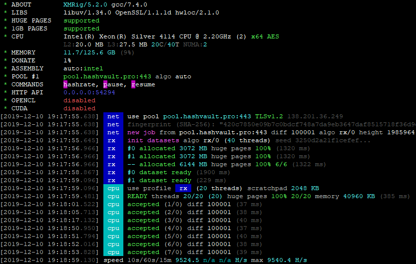

# XMRig

[](https://github.com/xmrig/xmrig/releases)
[](https://github.com/xmrig/xmrig/releases)
[](https://github.com/xmrig/xmrig/releases)
[](https://github.com/xmrig/xmrig/blob/master/LICENSE)
[](https://github.com/xmrig/xmrig/stargazers)
[](https://github.com/xmrig/xmrig/network)

XMRig High performance, open source, cross platform RandomX, KawPow, CryptoNight, AstroBWT and Argon2 CPU/GPU miner, with official support for Windows.

## Mining backends
- **CPU** (x64/x86/ARM)
- **OpenCL** for AMD GPUs.
- **CUDA** for NVIDIA GPUs via external [CUDA plugin](https://github.com/xmrig/xmrig-cuda).



## Download
* Binary releases: https://github.com/xmrig/xmrig/releases
* Git tree: https://github.com/xmrig/xmrig.git
  * Clone with `git clone https://github.com/xmrig/xmrig.git` :hammer: [Build instructions](https://github.com/xmrig/xmrig/wiki/Build).

## Usage
The preferred way to configure the miner is the [JSON config file](src/config.json) as it is more flexible and human friendly. The command line interface does not cover all features, such as mining profiles for different algorithms. Important options can be changed during runtime without miner restart by editing the config file or executing API calls.

* **[xmrig.com/wizard](https://xmrig.com/wizard)** helps you create initial configuration for the miner.
* **[workers.xmrig.info](http://workers.xmrig.info)** helps manage your miners via HTTP API.

### Command line options
```
Network:
  -o, --url=URL                 URL of mining server
  -a, --algo=ALGO               mining algorithm https://xmrig.com/docs/algorithms
      --coin=COIN               specify coin instead of algorithm
  -u, --user=USERNAME           username for mining server
  -p, --pass=PASSWORD           password for mining server
  -O, --userpass=U:P            username:password pair for mining server
  -x, --proxy=HOST:PORT         connect through a SOCKS5 proxy
  -k, --keepalive               send keepalive packet for prevent timeout (needs pool support)
      --nicehash                enable nicehash.com support
      --rig-id=ID               rig identifier for pool-side statistics (needs pool support)
      --tls                     enable SSL/TLS support (needs pool support)
      --tls-fingerprint=HEX     pool TLS certificate fingerprint for strict certificate pinning
      --daemon                  use daemon RPC instead of pool for solo mining
      --daemon-poll-interval=N  daemon poll interval in milliseconds (default: 1000)
  -r, --retries=N               number of times to retry before switch to backup server (default: 5)
  -R, --retry-pause=N           time to pause between retries (default: 5)
      --user-agent              set custom user-agent string for pool
      --donate-level=N          donate level, default 5%% (5 minutes in 100 minutes)
      --donate-over-proxy=N     control donate over xmrig-proxy feature

CPU backend:
      --no-cpu                  disable CPU mining backend
  -t, --threads=N               number of CPU threads
  -v, --av=N                    algorithm variation, 0 auto select
      --cpu-affinity            set process affinity to CPU core(s), mask 0x3 for cores 0 and 1
      --cpu-priority            set process priority (0 idle, 2 normal to 5 highest)
      --cpu-max-threads-hint=N  maximum CPU threads count (in percentage) hint for autoconfig
      --cpu-memory-pool=N       number of 2 MB pages for persistent memory pool, -1 (auto), 0 (disable)
      --cpu-no-yield            prefer maximum hashrate rather than system response/stability
      --no-huge-pages           disable huge pages support
      --asm=ASM                 ASM optimizations, possible values: auto, none, intel, ryzen, bulldozer
      --randomx-init=N          thread count to initialize RandomX dataset
      --randomx-no-numa         disable NUMA support for RandomX
      --randomx-mode=MODE       RandomX mode: auto, fast, light
      --randomx-1gb-pages       use 1GB hugepages for dataset (Linux only)
      --randomx-wrmsr=N         write custom value (0-15) to Intel MSR register 0x1a4 or disable MSR mod (-1)
      --randomx-no-rdmsr        disable reverting initial MSR values on exit
      --astrobwt-max-size=N     skip hashes with large stage 2 size, default: 550, min: 400, max: 1200
      --astrobwt-avx2           enable AVX2 optimizations for AstroBWT algorithm

API:
      --api-worker-id=ID        custom worker-id for API
      --api-id=ID               custom instance ID for API
      --http-host=HOST          bind host for HTTP API (default: 127.0.0.1)
      --http-port=N             bind port for HTTP API
      --http-access-token=T     access token for HTTP API
      --http-no-restricted      enable full remote access to HTTP API (only if access token set)

OpenCL backend:
      --opencl                  enable OpenCL mining backend
      --opencl-devices=N        comma separated list of OpenCL devices to use
      --opencl-platform=N       OpenCL platform index or name
      --opencl-loader=PATH      path to OpenCL-ICD-Loader (OpenCL.dll or libOpenCL.so)
      --opencl-no-cache         disable OpenCL cache
      --print-platforms         print available OpenCL platforms and exit

CUDA backend:
      --cuda                    enable CUDA mining backend
      --cuda-loader=PATH        path to CUDA plugin (xmrig-cuda.dll or libxmrig-cuda.so)
      --cuda-devices=N          comma separated list of CUDA devices to use
      --cuda-bfactor-hint=N     bfactor hint for autoconfig (0-12)
      --cuda-bsleep-hint=N      bsleep hint for autoconfig
      --no-nvml                 disable NVML (NVIDIA Management Library) support

TLS:
      --tls-gen=HOSTNAME        generate TLS certificate for specific hostname
      --tls-cert=FILE           load TLS certificate chain from a file in the PEM format
      --tls-cert-key=FILE       load TLS certificate private key from a file in the PEM format
      --tls-dhparam=FILE        load DH parameters for DHE ciphers from a file in the PEM format
      --tls-protocols=N         enable specified TLS protocols, example: "TLSv1 TLSv1.1 TLSv1.2 TLSv1.3"
      --tls-ciphers=S           set list of available ciphers (TLSv1.2 and below)
      --tls-ciphersuites=S      set list of available TLSv1.3 ciphersuites

Logging:
  -S, --syslog                  use system log for output messages
  -l, --log-file=FILE           log all output to a file
      --print-time=N            print hashrate report every N seconds
      --health-print-time=N     print health report every N seconds
      --no-color                disable colored output
      --verbose                 verbose output

Misc:
  -c, --config=FILE             load a JSON-format configuration file
  -B, --background              run the miner in the background
  -V, --version                 output version information and exit
  -h, --help                    display this help and exit
      --dry-run                 test configuration and exit
      --export-topology         export hwloc topology to a XML file and exit
      --title                   set custom console window title
      --no-title                disable setting console window title      
```

## Donations
* Default donation 5% (5 minutes in 100 minutes) can be reduced to 1% via option `donate-level` or disabled in source code.
* XMR: `48edfHu7V9Z84YzzMa6fUueoELZ9ZRXq9VetWzYGzKt52XU5xvqgzYnDK9URnRoJMk1j8nLwEVsaSWJ4fhdUyZijBGUicoD`
* BTC: `1P7ujsXeX7GxQwHNnJsRMgAdNkFZmNVqJT`

## Contacts
* support@xmrig.com
* [reddit](https://www.reddit.com/user/XMRig/)
* [twitter](https://twitter.com/xmrig_dev)
